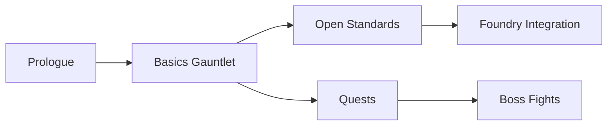

# Agent Framework Quests

Agent Framework Quests is a Jupyter-first curriculum for the Microsoft Agent Framework. It complements the official samples by leaning into story-driven labs, fixtures, and auto-grading so teams can experiment completely offline before connecting to production services.

The learning path runs in four acts: **Prologue**, **Basics Gauntlet**, **Quests**, and **Boss Fights**. Each notebook uses deterministic fixtures plus a `USE_REAL_CLIENT` toggle so learners can flip between mock mode and live endpoints at their own pace.

Offline mode relies on the datasets under `_fixtures/` and writes artifacts to `_runs/<lab>/...` for grading and dashboards. Switch `USE_REAL_CLIENT=True` once credentials are ready and the same notebooks will point at real Agent Framework clients.

[](LICENSE)
[](#)
[](Launcher.ipynb)
[](docs/index.md)
[](5-devops/containers/Dockerfile)
[](_fixtures/)

---

## 🚀 Quickstart

### Local (recommended for notebooks)
1. Create a virtual environment with Python 3.11.
   - macOS/Linux:
     ```bash
     python3.11 -m venv .venv && source .venv/bin/activate
     pip install -U pip jupyterlab nbformat nbconvert nbval
     ```
2. Launch JupyterLab and open `Launcher.ipynb`.
   ```bash
   jupyter lab
   ```
3. Work through notebooks in order; progress is written to `_runs/`.
4. See `docs/troubleshooting.md` if you hit snags.

### Docs-only (via Docker)
Use the provided container to preview documentation with MkDocs.
```bash
docker build -f 5-devops/containers/Dockerfile -t afq:dev .
docker run --rm -it -p 8000:8000 -v "$PWD":/workspace afq:dev \
  mkdocs serve -a 0.0.0.0:8000
```
Visit http://localhost:8000

---

## 🗺️ Curriculum Map



---

## 🧪 Offline First → Online When Ready
- Notebooks default to `USE_REAL_CLIENT=False` and use `_fixtures/` to simulate responses.
- Artifacts are written to `_runs/<lab>/...` for grading and dashboards.
- When credentials are ready, set `USE_REAL_CLIENT=True` and provide provider env vars (e.g., in your shell or a local `.env`).

> Tip: Run end-to-end offline first; then flip to real clients to validate integrations with the same notebooks.

---

## 🧱 Repository Structure

```text
.
├── 0-prologue-notebooks/
├── 1-basics-gauntlet-notebooks/
├── 1b-open-standards-notebooks/
├── 1c-foundry-integration-notebooks/
├── 2-quests-notebooks/
├── 3-boss-fights-notebooks/
├── 4-evals/
├── 5-devops/
│   ├── ci/
│   ├── containers/
│   │   └── Dockerfile
│   └── deploy/
├── _fixtures/
├── _runs/
├── course/
├── docs/
│   ├── index.md
│   ├── why_notebooks.md
│   ├── agent_framework_cheatsheet.md
│   ├── cookbook_patterns_adapted.md
│   ├── governance_safety.md
│   └── troubleshooting.md
├── tools/
│   ├── backoff.py
│   ├── dag_export.py
│   ├── redact_middleware.py
│   └── tee_stream.py
├── Launcher.ipynb
├── mkdocs.yml
└── LICENSE
```

---

## 🧩 Handy utilities (`tools/`)
- **`backoff.py`** – simple retry/backoff helpers for flaky integrations.
- **`dag_export.py`** – export notebook/task DAGs for visualization or checks.
- **`redact_middleware.py`** – strip secrets/PII from logs and artifacts.
- **`tee_stream.py`** – tee outputs to both console and files for grading.

---

## 📚 Documentation
- Sources live under `docs/` and are wired by `mkdocs.yml`.
- Serve locally with MkDocs:
  ```bash
  mkdocs serve
  ```
- Build static site:
  ```bash
  mkdocs build
  ```

Key pages:
- `docs/index.md` – overview & quickstart
- `docs/agent_framework_cheatsheet.md` – API/usage reference
- `docs/cookbook_patterns_adapted.md` – patterns and recipes
- `docs/governance_safety.md` – safety and governance
- `docs/troubleshooting.md` – common pitfalls and fixes

---

## ✅ Evaluate Progress
- Use `4-evals/Grader.ipynb` to review completion stats and scoring across labs.

---

## 🤝 Contributing
Pull requests are welcome. Please:
- Keep notebooks deterministic and idempotent.
- Prefer fixtures in `_fixtures/` for offline repeatability.
- Clear notebook outputs before committing.
- Add or update docs where helpful.

---

## 📄 License
This project is licensed under the MIT License – see [`LICENSE`](LICENSE).

---

## ⭐️ If this helps you
Give the repo a star and share your builds! It helps others find the curriculum and keeps the roadmap moving.
